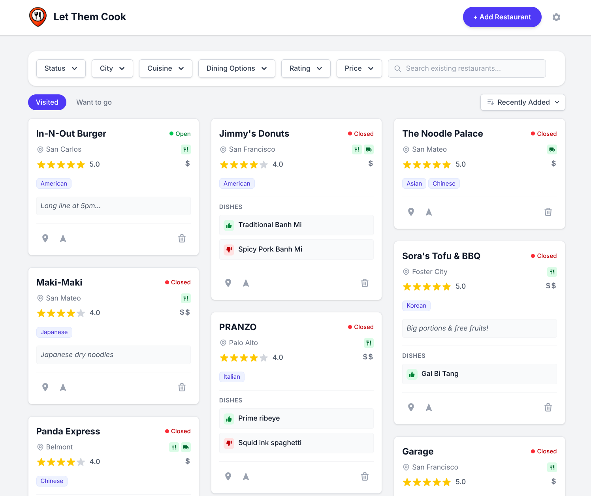

# Let Them Cook

A self-hosted personal restaurant tracker.



## Features

* Save places you have visited and keep a separate wishlist for restaurants you want to try.
* Keep useful context for each spot: location, map links, price range, opening hours, and cuisines, etc.
* Track restaurants and dishes with ratings and personal notes.
* Filter by city, cuisine, and more to quickly find the right option.
* Mobile-friendly on desktop and phone, with installable PWA support.

## Prerequisites

A Google Maps API Key with **Places API (New)** enabled is required. If you don't already have one, follow the official [setup guide](https://developers.google.com/maps/documentation/places/web-service/get-api-key).

You will be asked to set up billing; however, it's effectively free for personal use thanks to the generous free quota. Note that Google's pricing models may change over time. As with any API service, always manage your billing settings at your own discretion.

It's strongly recommended to [apply API key restrictions](https://docs.cloud.google.com/docs/authentication/api-keys#api_key_restrictions) to prevent unauthorized use. Because the key is visible in the page source, anyone with access to the page could technically see it.

## Running with Docker

By default, the web UI is accessible at `<host-ip>:5000`. The default password is `letthemcook`. Be sure to change the password via the settings page if you plan to expose the app to the internet.

### Docker Compose

```yaml
services:
  let-them-cook:
    image: nyuhan/let-them-cook:latest
    container_name: let-them-cook
    ports:
      - "5000:5000"
    environment:
      GOOGLE_MAPS_API_KEY: '<YOUR_API_KEY>'
    volumes:
      - /path/to/data:/data
    restart: unless-stopped
```

### Docker Run

```bash
docker run -d \
  --name let-them-cook \
  -p 5000:5000 \
  -e GOOGLE_MAPS_API_KEY='<YOUR_API_KEY>' \
  -v /path/to/data:/data \
  --restart unless-stopped \
  nyuhan/let-them-cook:latest
```

### Environemnt Variables

| Name                | Description                                             |
| ------------------- | ------------------------------------------------------- |
| GOOGLE_MAPS_API_KEY | Required                                                |
| DISABLE_LOGIN       | Optional. Disables the login feature. Use with caution. |

## Development

### Requirements

* Python 3.9+
* The [Tailwind CSS standalone CLI](https://github.com/tailwindlabs/tailwindcss/releases/download/v4.2.2/tailwindcss-linux-x64) installed and available on your `PATH` as `tailwindcss`.

### Running locally

1. **Create a virtual environment and install dependencies**:

    ```bash
    python3 -m venv .venv
    source .venv/bin/activate
    pip install -r requirements.txt
    ```

1. **Configure Environment Variables**:
    Create a `.env` file in the project root and add your Google Maps API key:

    ```bash
    echo 'GOOGLE_MAPS_API_KEY=<YOUR_API_KEY>' > .env
    ```

1. **Build the CSS**:

    ```bash
    tailwindcss -i static/tailwind.input.css -o static/tailwind.css --minify
    ```

    To automatically rebuild on template changes during development:

    ```bash
    tailwindcss -i static/tailwind.input.css -o static/tailwind.css --watch
    ```

1. **Run the application**:

    ```bash
    python app.py
    ```

1. **Access the app**:
    Open [http://localhost:8000](http://localhost:8000) in your browser.

    *Note: Data will be stored in `instance/restaurants.db` by default.*

### Testing

All test dependencies are installed inside the virtual environment:

```bash
source .venv/bin/activate
pip install -r requirements.txt
playwright install chromium
```

#### Run all tests (unit + E2E)

```bash
pytest
```

This runs backend unit tests and offline E2E browser tests. Google Maps tests are excluded by default.

#### Run only backend unit tests

```bash
pytest tests/test_app.py -v
```

#### Run only E2E browser tests

```bash
pytest tests/e2e/ -v
```

#### Run with visible browser (headed mode)

```bash
pytest tests/e2e/ -v --headed --slowmo=500
```

#### Run a specific test

```bash
pytest tests/e2e/ -k "TestDishAdd" -v
```

#### Run Google Maps integration test

Requires a valid `GOOGLE_MAPS_API_KEY` in `.env` and network access:

```bash
pytest tests/e2e/ -m google_maps -v
```
